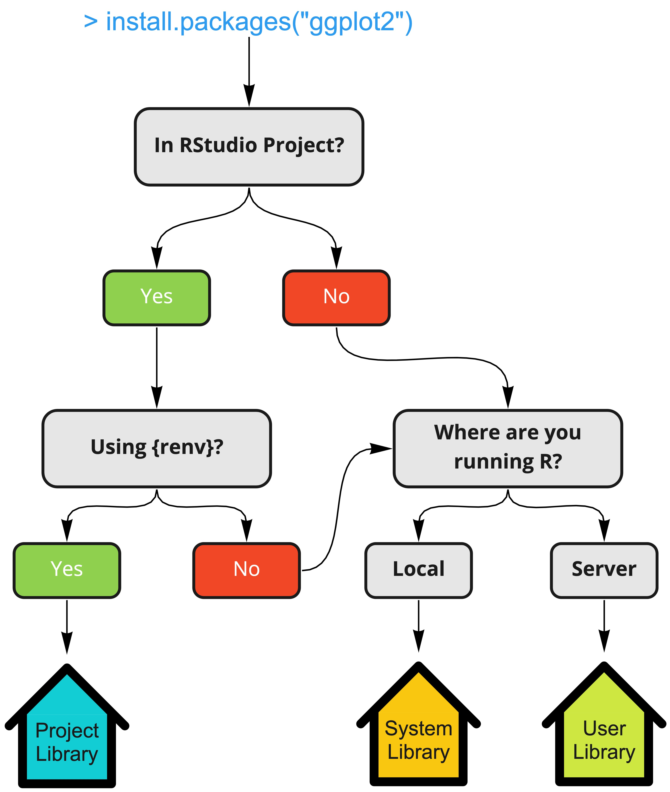

# Installing your first R package

For this example, we'll focus on `ggplot2`, which is a popular R package for data visualization. Let's first try to load the package.

```{r eval=FALSE}
# Try loading ggplot2
library("ggplot2")
```

If running this command for the first time, you'll likely see the output below:

> ``` {style="color: red"}
> Error in library("ggplot2") : there is no package called ‘ggplot2’
> ```

This is because we have not yet **installed** `ggplot2`. Most packages in R can be installed using the `install.packages()` function:

```{r}
# Install ggplot2
install.packages("ggplot2")
```

You may see some logs printed to the screen, but as long as you don't see any errors, then `ggplot2` was likely installed correctly. To ensure that `ggplot2` has been properly installed, we can check which version of `ggplot2` was installed:

```{r}
# Check ggplot2 version
packageVersion("ggplot2")
```

Let's now try to load `ggplot2` again:

```{r}
# Try loading ggplot2 again
library("ggplot2")
```

To recap:

-   `install.packages()`: installs a package. Think of it as "buying a car."

-   `library()`: loads a package. Think of it as "turning on the car."

Now that `ggplot2` is "turned on", we can now utilize the various **functions** within `ggplot2`. You can be explicit with your function calls by giving it the `package::` prefix. For example, `ggplot2::qplot()` tells the R interpreter to use the `qplot()` function within the `ggplot2` package.

```{r}
ggplot2::qplot(x = mpg, y = wt, data = mtcars)
```

You may see R code that does not use the `package::` prefix, which is fine, but it's recommended to prevent *namespace issues*. For example, what if the function `qplot()` also existed in another package in your environment 😯?

# Understanding your Package Environment

## Repositories

When we ran the `install.packages("ggplot2")` function above, we had to install `ggplot2` from somewhere...but where? To revisit the above car analogy, imagine you need to buy a new car. At some point you'll likely find yourself at a car dealership where you'll purchase a new car. If the new car is our "package", the car dealership is our **repository**. To see where we went shopping for our `ggplot2` package, we can run the `options("repos")` function to list the repositories currently available in our environment:

```{r}
# Let's list our repositories
options("repos")
```

Keep in mind that your repositories will likely be different than mine!

## Libraries

When you buy a new car from a dealership, you drive it home and park it in your garage. Similarly, when you install a new package from a repository, you need to park it somewhere in your environment. The garages for R packages are known as **libraries**. Libraries in your R environment are nothing but files on your computer/server. Let's see what libraries are currently in our environment by running the `.libPaths()` function:

```{r}
# Where are my R package libraries?
.libPaths()
```

Some notes regarding libraries:

-   R libraries are tied to R versions (eg. `R-4.1`). If you install a new version of R, a fresh library will be created

-   There are three types of libraries: System, User, and Project libraries.

    -   **System**: If running R locally on a desktop, this is the default "home" library and is manged by the user themselves. If running on a server (e.g., RStudio Workbench), this is a common library shared among all users and is configured/managed by your system administrator.

    -   **User**: On RStudio Workbench, this is the default "home" directory managed by the user themselves.

    -   **Project:** If using [renv](https://rstudio.github.io/renv/index.html), then all packages associated with that RStudio Project will be saved into the `renv` directory and is managed by the user.

-   Use the `Packages` tab to see what libraries you are using and what packages are within each.

<center>

{style="location: center" width="353"}

</center>

## Recap

Hopefully, with this small example, you have a better understanding of R packages, where they come from (repositories), how to install/use them, and where they are stored (libraries). Let's recap the above steps:

1.  We installed the `ggplot2` using the `install.packages("ggplot2")` function.
2.  `ggplot2` was "purchased" from an **R repository**. Your current repositories can be listed using the `options("repos")` function.
3.  Once obtained from the repository, it was then saved to an **R library** on our system.
4.  We then **loaded** the `ggplot2` packages into our environment using the `library("ggplot2")` function.
5.  Once loaded, we can then call functions from within `ggplot2` including `ggplot2::qplot()`.
